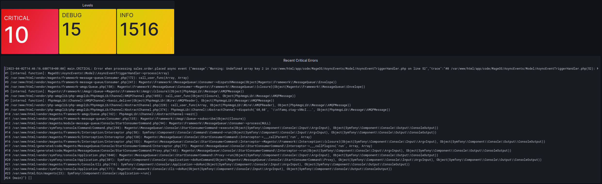

# Docker Compose Setup for MageOS
A super simple docker compose setup for local development.

## Features
* Fast, simple: No custom scripts or wrappers. Just plain `docker compose`
* Xdebug support: There is no need to toggle xdebug on/off. Set the `XDEBUG_SESSION` cookie to get into debugging mode.


## Monitoring Support
Experiemental support to ingest logs generated by Magento. Enable with docker compose profile flag. e.g: `docker compose --profile grafana up -d`



## Install a new project
Create an empty `src/` folder in the root

Bring all services up and shell into the php container
```bash
docker compose up -d
docker compose exec php bash
```

Install MageOS
```
composer create-project --repository-url="https://mirror.mage-os.org/" "magento/project-community-edition:>=2.4.6 <2.4.7" .
```

Run install command. An example is provided below. Make necessary modifications as you see fit.

### Example Install Command
```bash
bin/magento setup:install \
--cleanup-database \
--use-secure=1 \
--use-secure-admin=1 \
--base-url=https://mageos.test:8080/ \
--db-host=db \
--db-name=magento2 \
--db-user=magento2 \
--db-password=magento2 \
--backend-frontname=admin \
--admin-firstname=admin \
--admin-lastname=admin \
--admin-email=admin@admin.com \
--admin-user=admin \
--admin-password=password1 \
--language=en_AU \
--currency=AUD \
--timezone=Australia/Adelaide \
--use-rewrites=1 \
--search-engine=opensearch \
--opensearch-host=es \
--opensearch-port=9200 \
--opensearch-index-prefix=magento2 \
--opensearch-timeout=15 \
--amqp-host=mq \
--amqp-port=5672 \
--amqp-user=guest \
--amqp-password=guest
```

#### Configure Redis for caching

```bash
bin/magento setup:config:set --cache-backend=redis --cache-backend-redis-server=redis --cache-backend-redis-db=0
```

```bash
bin/magento setup:config:set --page-cache=redis --page-cache-redis-server=redis --page-cache-redis-db=1
```
